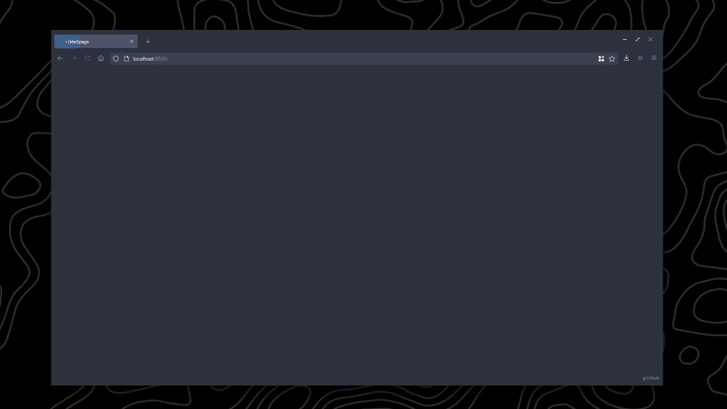

# Startpage <!-- omit in toc --> 

[Live preview](https://startpage.easun.me)

<!-- [Live Preview](https://kencx.github.io/startpage/) -->
## Table of Contents <!-- omit in toc --> 
- [Installation](#installation)
	- [Materials](#materials)
	- [Instructions](#instructions)
		- [Basic Setup](#basic-setup)
		- [Getting an OpenWeatherMap API Key](#getting-an-openweathermap-api-key)
		- [Changing the search engine](#changing-the-search-engine)
		- [Using as a new tab/disabling animations](#using-as-a-new-tabdisabling-animations)
- [Browser setup](#browser-setup)
- [Misc. Info](#misc-info)
## Installation

### Materials
- Code editor (e.g. VSCode, Notepad++, etc.)
- Basic html/css/js knowledge (optional)
- OpenWeatherMap API Key (only if you want to use the weather feature)

### Instructions

#### Basic Setup

1. Grab the latest [release](#)
2. Unzip files and move to a convenient location (e.g. Documents)
3. Go into your browser settings (Firefox: `about:preferences`, Chrome/chromium-based: `chrome://settings/`)
4. Set the homepage to `file:///[PATH TO STARTPAGE]/index.html` (example: `file:///D:/documents/startpage/index.html`)
5. Open the homepage and check if things are working. The weather should be stuck at `loading...`. We will change that in the next step.
6. Open index.html in your code editor of choice.
   1. Find the `<section>` elements and replace the `website text`, `section header`, and `https://example.com` with your own links and text. You can copy-paste or delete the `<section>` elements to fit your needs (I recommend a maximum of 3-4 sections).
   2. If you want the weather to be displayed, leave the `weather` variable as-is. Otherwise, change it to `false` and skip the rest of this step.
   3. In the `<script>` tag, replace the `[API KEY]` with your own OpenWeatherMap API key. (See [here](#getting-an-openweathermap-api-key) for instructions.)
   4. In the `<script>` tag, replace the `lon` and `lat` variables with your own longitude and latitude respectively.
   5. In the `<script>` tag, change the `units` variable to either `imperial` or `metric`.
7. If you want to replace the image, replace the `image.gif` file with your own image/gif of choice.
8. You should now have a working startpage!

#### Getting an OpenWeatherMap API Key
1. Go to [OpenWeatherMap](https://home.openweathermap.org/users/sign_up) and sign up.
2. Check your inbox for an email from OpenWeatherMap to verify your email address, and verify it.
3. Go to [OpenWeatherMap](https://home.openweathermap.org/api_keys). There should be an API key already generated for you. If not, generate one. The API key name does not matter.
4. You should now have an API key! It will take a few hours for it to be active, please do not panic if the weather is stuck on `loading...` unless it has been a day or two.

#### Changing the search engine
By default, the search engine is DuckDuckGo. You can change it to another search engine of choice by replacing the link in the `<form>` tag with another below.

|Search Engine |Link  |
--- | --- |
|Google|`https://google.com/search`|
|Duckduckgo|`https://duckduckgo.com/`|
|Bing|`https://bing.com/search`|
|Ask Jeeves (why)|`https://askjeeves.net/results.html`|

#### Using as a new tab/disabling animations
This is meant as a start page, and not a new tab page because of the animations. 

This [(firefox)](https://addons.mozilla.org/en-US/firefox/addon/new-tab-override/) [(chrome/chromium-based)](https://chrome.google.com/webstore/detail/new-tab-redirect/icpgjfneehieebagbmdbhnlpiopdcmna) extension changes the new tab page, and you can follow the directions below to 

Use as a new tab (only step 3 to disable animations):
1. Make a copy of the `index.html` file after you finished with the [basic setup](#basic-setup).
2. Rename it to `newTab.html` (you can name it other things too, I just recommend this).
3. Open `newTab.html` file in your code editor of choice.
   1. In the `<script>` tag, change the `animated` variable to `false`.
4. In the extension settings, set the new tab page to `file:///[PATH TO STARTPAGE]/newTab.html` (example: `file:///D:/documents/startpage/newTab.html`)

## Browser setup
- Browser: Firefox
- Theme: [Nord - Firefox Theme](https://www.deviantart.com/dpcdpc11/art/Nord-for-Firefox-837860916)
- Font: Product Sans
- Wallpaper: You can't have it

## Misc. Info
- Startpage Font: Source Code Pro
- Cat Gif: [Here](https://twitter.com/avogado6/status/1165595520967954432?s=19)

